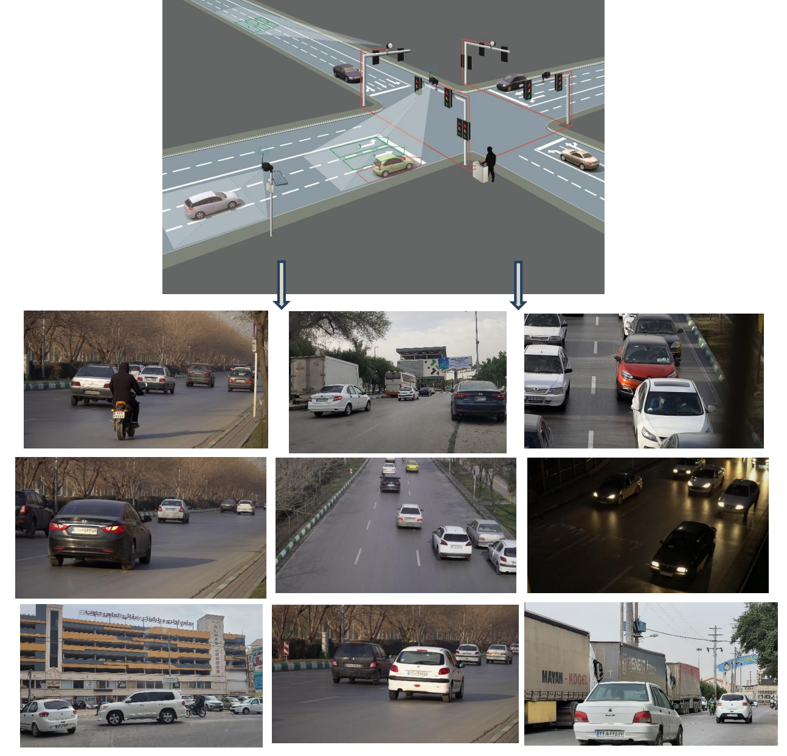

# VDIS (Vehicle Detection Image set) v1:
## A Scalable Benchmark for Vehicle Detection and Counting

[Mohammadali Charoosaei](mailto:m.a.charoosaei@gmail.com) <sup>1*</sup>, [Hamidreza Charoosaei](mailto:hamidreza.tnt92@gmail.com) <sup>2</sup>, [Yasaman Kabiri](mailto:kabiriyacmn@gmail.com) <sup>2</sup>

<sup>1</sup> Department of Computer Engineering, Jundi-Shapur University of Technology, <br/> <sup>2</sup> Department of Computer Engineering, Azad University


VDIS (Vehicle Detection Image Set), which includes XXX photos from cameras and XXX vehicle objects, is the name of the image set created for this article. These pictures were captured by actual traffic cameras, which are employed to ticket vehicles that exceed speed limits and other regulations. Examples of the VDIS images are shown in this Figure.


## Terms & Conditions

- The dataset is available for non-commercial research purposes only.
- You agree not to reproduce, duplicate, copy, sell, trade, resell or exploit for any commercial purposes, any portion of the images and any portion of derived data.
- You agree not to further copy, publish or distribute any portion of the fudanroilab. Except, for internal use at a single site within the same organization it is allowed to make copies of the dataset.


## How to get the access

This dataset is publicly available. It is free for professors and researcher scientists affiliated to a University.

Permission to use but not reproduce or distribute our database is granted to all researchers given that the following steps are properly followed: Send an e-mail to Mohammadali Charoosaei (m.a.charoosaei@gmail.com) before downloading the dataset. You will need a password to access the files of this dataset. Your Email MUST be set from a valid University account and MUST include the following text:

````
1. Subject: Application to download the VDIS         
2. Name: <your first and last name>
3. Affiliation: <University where you work>
4. Department: <your department>
5. Position: <your job title>
6. Email: <must be the email at the above mentioned institution>

I have read and agree to the terms and conditions specified in the  VDIS webpage. 
This dataset will only be used for research purposes. 
I will not make any part of this dataset available to a third party. 
I'll not sell any part of this dataset or make any profit from its use.
````

